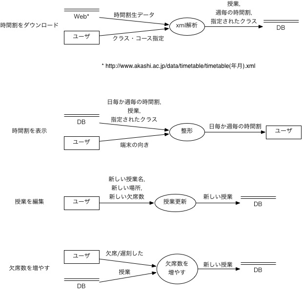

# 要求定義書

## システム化の目的

- 時間割を知ることができる
- 欠席数を正確に管理できる
- ブラウザよりスマフォアプリの方が簡便

## システムの機能要件

- 時間割を表示できる
	- 授業名・場所・時限・欠席数を表示できる
	- 日ごとの時間割と週ごとの時間割を画面の向きに応じてそれぞれ表示できる
- 時間割を編集できる
	- 指定したクラス・コースに応じた時間割をWebからダウンロードし更新できる
	- 授業名・場所を編集できる
	- 欠席数を増加/減少させることができる
- 欠席数を記録できる
	- 欠席・遅刻は特に簡単に記録できる

## データフローダイアグラム



## データディクショナリ

```
時間割生データ = 1Eの時間割 + 2Eの時間割 + ... + 2ACの時間割
週毎の時間割 = 月曜日1限の授業 + 月曜日2限の授業 + ... + 金曜日4限の授業
日毎の時間割 = 1限の授業 + 2限の授業 + ... + n限の授業
授業 = 授業名 + 場所 + 欠席数
クラス = [1M|1E|...|2AC]
端末の向き = [横向き|縦向き]
```

## ミニスペック

```
第一DFD
時間割をダウンロードする処理を開始する
    ユーザは自分のクラス・コースを指定する
    web上から時間割生データをダウンロードする
    ダウンロードしたxmlファイルを解析する
    解析結果（授業、週ごとの時間割、指定されたクラス）をDBに保存する
処理を終了する

第二DFD
時間割を表示する処理を開始する
    アプリの起動が初回の場合
        DBに保存されたデータが無いため、何も表示しない
    そうで無い場合
        ユーザはクラス、コースを指定する
        DBから指定されたクラス・コースの日毎か週毎の時間割、授業データを取得する
        端末の向きが縦の場合
            日毎の時間割を整形して表示する
        端末の向きが横の場合
            週毎の時間割を整形して表示する
処理を終了する

第三DFD
授業データを編集する処理を開始する
    ユーザは任意の授業を指定する
    ユーザはその授業に対して「新しい授業名」、「新しい場所」、「新しい欠席数」を指定する
    DBを更新する
処理を終了する

第四DFD
欠席数・遅刻数を増やす処理を開始する
    ユーザは任意の授業を指定する
    DBから指定された授業データを取得する
    ユーザはその授業に対して「欠席」か「遅刻」を指定する
    授業に対する欠席数を増加させる
    DBを更新する
処理を終了する
```

## 開発スケジュール

| 4/24 | 5/22 | 7/10 | 7/17 | 7/24 |
|:--|:--|:--|:--|:--|
| 要求分析・定義 | 外部・内部設計 | プログラミング | テスト修正とドキュメント作成 | ソフトウェア発表 |

## 開発体制

### 西田

- 要求分析と要求定義
- テストとドキュメント作成

### 唐澤

- 外部設計と内部設計
- プログラム設計とプログラミング

